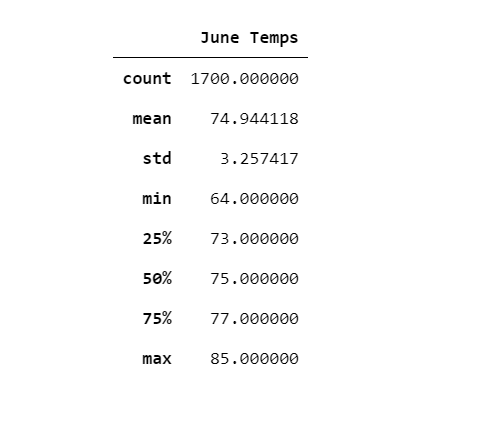
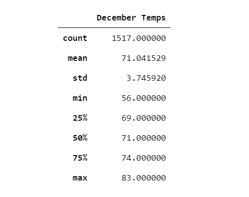
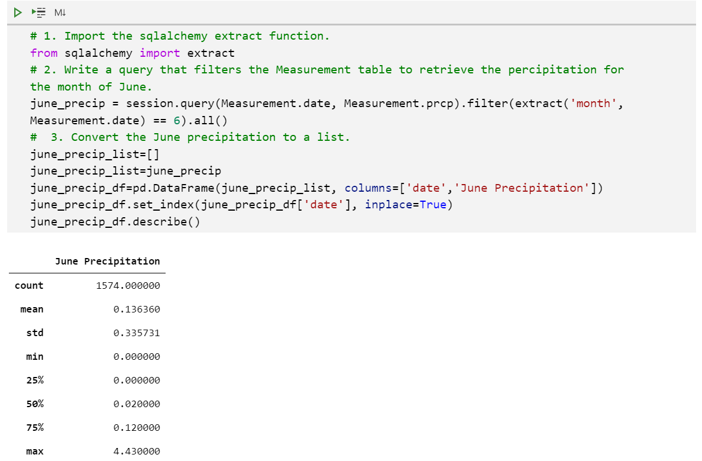
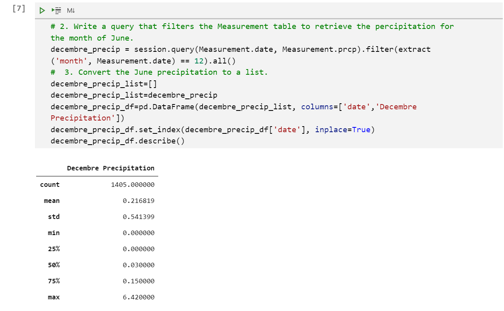

# Surf's Up with Advanced Data Storage and Retrieval

## Overview of the analysis:

The purpose on the analysis is to provide W.Avy with more information regarding temperature data for the months of June and December in Oahu, in order to determine if the surf and ice cream shop business is sustainable year-round.

## Results: 

o There is only 3.9 degrees difference in the average temperatures between June and December months (June temperature being the highest value).

o There is only 2 degrees difference in the maximum temperatures between June and December months (June temperature being the highest value).

o Despite the small degrees difference in the average and maximum temperatures between June and December months, the gap gets wider when we look at minimum temperatures where the difference is around 9 degrees.

  

## Summary:

The information gathered around the difference in temperatures between the months of June and December shows that, despite June weather being warmer than December, but December is still a good month for having Surf and Ice Cream activity.

The two below additional queries will allow us to gather more weather data for June and December: 

1.Same one used to collect June Temp, but collection precipitation data:

2.Same one used to collect DEC Temp, but collection precipitation data:

